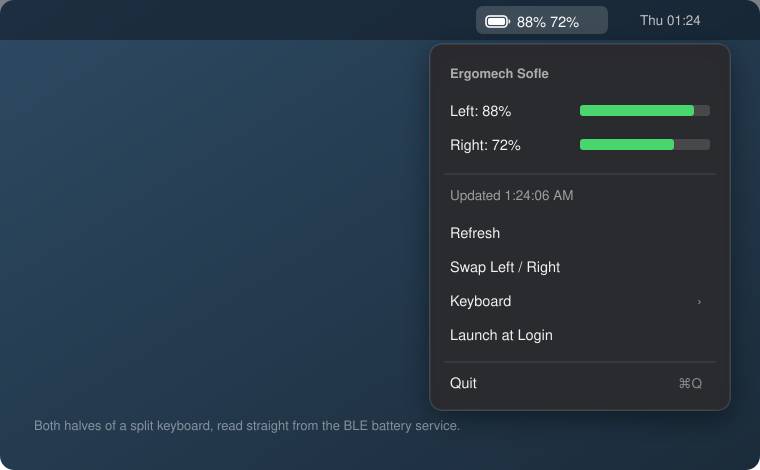

# Cell

A tiny macOS menu bar app that shows the battery level of a Bluetooth device —
including **both halves of a split keyboard**.



## Why this exists

macOS can display a battery level for a Bluetooth device only when that device
reports one through **HID**. Plenty of devices don't — they report over the
standard **GATT Battery Service** (`0x180F`) instead, and macOS simply ignores it.

[ZMK](https://zmk.dev) keyboards are the common case. Plug a wireless Sofle into
`system_profiler SPBluetoothDataType` and you'll see it listed with no battery
line at all; `ioreg` has no `BatteryPercent` key for it either. The keyboard is
broadcasting its charge the whole time — nothing on the Mac is listening.

Cell listens. It connects over CoreBluetooth, reads every battery service the
device exposes, and subscribes to notifications so levels update when they
change rather than on a polling timer.

For a split keyboard that means **both halves in the menu bar**: the central
half's own battery, plus the peripheral half's level relayed through it.

## Install

Download the latest `Cell.zip` from [Releases](../../releases), unzip, and drag
`Cell.app` to `/Applications`. Launch it and approve the Bluetooth prompt.

The app is **ad-hoc signed, not notarized** (no paid Apple Developer account),
so Gatekeeper will object the first time. Right-click the app → **Open** →
**Open**, which only has to be done once. If macOS insists the app is damaged:

```sh
xattr -dr com.apple.quarantine /Applications/Cell.app
```

Build it yourself if you'd rather not trust a binary — it's one Swift file and
takes a couple of seconds.

## Build from source

Requires the Xcode command line tools (`xcode-select --install`). No Xcode, no
package manager, no dependencies.

```sh
git clone https://github.com/pbardea/cell.git
cd cell
./build.sh                 # installs to ~/Applications/Cell.app
./build.sh /Applications   # or wherever you like
```

## Using it

The menu bar shows a system battery glyph and one percentage per battery the
device reports, turning red at 20%. The dropdown has:

- **Per-battery readings** with a charge bar. On a split keyboard these are
  labelled Left and Right.
- **Refresh** — force a re-read. Rarely needed; levels arrive via notifications.
- **Swap Left / Right** — appears for multi-battery devices, if the sides come
  out backwards for your layout.
- **Keyboard ▸** — pick which device to watch, if you have several.
- **Launch at Login**.

## FAQ

### How do I make a Sofle (or any ZMK split) report *both* halves?

By default a ZMK split central never fetches its peripheral's battery level, so
the other half's charge is invisible to the host no matter what app you run.
Two options turn it on, and **both default to `n`**. Add them to your keyboard's
`.conf` in your `zmk-config` (e.g. `config/sofle.conf`):

```ini
CONFIG_ZMK_SPLIT_BLE_CENTRAL_BATTERY_LEVEL_FETCHING=y
CONFIG_ZMK_SPLIT_BLE_CENTRAL_BATTERY_LEVEL_PROXY=y
```

- `FETCHING` lets the central read the peripheral's level over the split link.
- `PROXY` re-exposes it to the host as a second Battery Service instance.

Rebuild (GitHub Actions does this for you in a standard `zmk-config` repo) and
flash **the central half** — usually the left. The second characteristic is
compiled into the central, and the peripheral already exposes its own battery
over the split link, so it doesn't need reflashing for this. Flashing both is
still sensible to keep firmware versions matched.

A useful detail: these options only exist on a central build. Putting them in a
`.conf` shared by both halves is fine — the peripheral build logs a harmless
warning that it can't assign them, and compiles normally.

### I enabled the proxy and flashed, but still only see one battery

Your host cached the keyboard's old service database. Hosts don't re-enumerate
GATT services on an already-paired device, so your Mac still believes there's
one battery service.

Make it rediscover: **System Settings → Bluetooth → Forget This Device**, then
clear the keyboard's stale bond for that profile (on ZMK, the `&bt BT_CLR` key)
and pair again. Skipping the `BT_CLR` is the usual reason re-pairing then hangs
forever — the Mac wants a fresh pairing while the keyboard still thinks it's
bonded.

A lighter alternative that avoids unpairing entirely: switch the keyboard to an
unused BLE profile (`&bt BT_SEL 1`) and pair that. The host sees a brand new
device and discovers its services from scratch.

One more trap: after you forget a device, macOS drops any nickname you gave it,
so it reappears in the list under the name the firmware actually broadcasts
(`CONFIG_BT_DEVICE_NAME`, e.g. "Ergomech Sofle"). Don't go looking for the old
name — it's gone.

### Which reading is the left half and which is the right?

ZMK tags them, and Cell sorts by the tag rather than by discovery order:

| Label | GATT presentation format | Half |
|---|---|---|
| Left | `0x0106` "main" | central |
| Right | `0x0108` "auxiliary" (described "Peripheral 0") | peripheral |

The central is whichever half you flashed with `..._left`, which for most splits
is the left. If that doesn't match your build, use **Swap Left / Right**.

### Does it show whether a device is charging?

No. The Battery Service characteristic (`0x2A19`) is a single byte, 0–100, with
no charge state. BAS 1.1 defines a richer "Battery Level Status" characteristic
(`0x2BED`) that carries a charging flag, but ZMK doesn't implement it — so a
keyboard on USB simply reads 100% rather than "charging".

### It picked my mouse instead of my keyboard

Mice and headphones expose battery services too. Open **Keyboard ▸** and choose
the right device; that choice is remembered. Cell never persists a device it
picked on its own, only one you select.

### Does it work with non-ZMK devices?

Anything exposing the standard GATT Battery Service, yes. It's most useful for
devices macOS ignores, which in practice means ZMK keyboards — macOS already
reports most mice natively, and AirPods use Apple's own protocol.

QMK keyboards over Bluetooth generally don't expose a GATT battery service, so
they won't work.

### Does it drain my keyboard's battery?

Negligibly. Cell doesn't poll: it subscribes to notifications and the keyboard
pushes a value when the level changes. ZMK reports at
`CONFIG_ZMK_BATTERY_REPORT_INTERVAL` (60s by default) and only sends on change.

### Why does it need Bluetooth permission?

Reading GATT requires CoreBluetooth, which is TCC-protected. Cell only reads
battery characteristics — it never writes to your device, and nothing leaves
your Mac.

## How it works

Already-paired HID devices stay connected to the OS, so there's no scanning:
`retrieveConnectedPeripherals(withServices:)` returns them and their GATT
services remain readable while they act as a keyboard or mouse. Cell discovers
every `0x180F` service, reads `0x2A19` from each, subscribes for notifications,
and reads the Characteristic Presentation Format descriptor to label the
batteries.

`Tools/` holds two small diagnostics used to develop this, handy if you're
debugging your own firmware:

```sh
swiftc -O Tools/probe.swift -o probe && ./probe   # dump a device's services,
                                                  # batteries and descriptors
swiftc -O Tools/scan.swift  -o scan  && ./scan    # list advertising BLE devices
```

## License

MIT — see [LICENSE](LICENSE).
