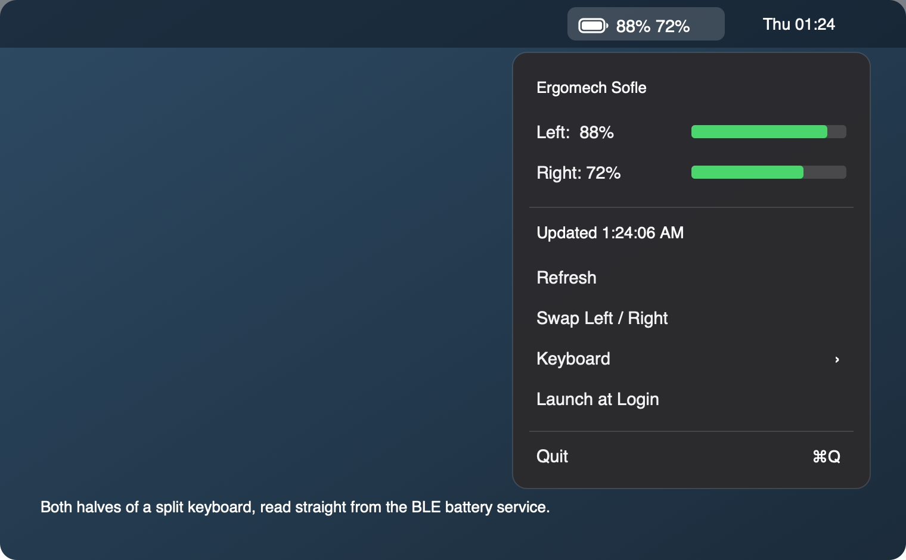

# Cell

**Battery levels for Bluetooth devices in your macOS menu bar — including both halves of a split keyboard.**



## Why

- macOS shows battery only for devices that report it over **HID**.
- ZMK keyboards report over the **GATT Battery Service** (`0x180F`) — macOS ignores it entirely.
- Your wireless Sofle shows **no battery anywhere** on macOS. Cell reads it directly.
- Split keyboards get **both halves**, side by side.

## Install

1. Download `Cell.zip` from [Releases](../../releases) → unzip → drag to `/Applications`.
2. Right-click → **Open** (unsigned app, one time only).
3. Approve the Bluetooth prompt.

> Gatekeeper says "damaged"? `xattr -dr com.apple.quarantine /Applications/Cell.app`

## Split keyboards: showing both halves

ZMK doesn't report the peripheral half by default. Add to your `zmk-config` `.conf`:

```ini
CONFIG_ZMK_SPLIT_BLE_CENTRAL_BATTERY_LEVEL_FETCHING=y
CONFIG_ZMK_SPLIT_BLE_CENTRAL_BATTERY_LEVEL_PROXY=y
```

- **Both default to `n`** — this is the #1 reason only one half shows.
- `FETCHING` = central reads the peripheral over the split link. `PROXY` = exposes it to your Mac.
- Flash **the central half** (usually left). The peripheral needs no reflash.
- Safe to put in a shared `.conf` — the peripheral build logs a harmless warning.

### Still only one half after flashing?

Your Mac cached the old service list. Hosts don't re-scan a paired device.

- **Forget** the device in System Settings → Bluetooth
- Press **`&bt BT_CLR`** on the keyboard ← *skipping this makes re-pairing hang forever*
- Pair again

> Lighter option: switch to an unused profile (`&bt BT_SEL 1`) and pair that — the Mac sees a new device.
>
> After forgetting, macOS drops your nickname. Look for the firmware's real name (`CONFIG_BT_DEVICE_NAME`), not the old one.

## Usage

| | |
|---|---|
| **Menu bar** | Battery glyph + one number per half, red at 20% |
| **Swap Left / Right** | If the sides read backwards |
| **Hide Battery Icon** | Numbers only, no glyph |
| **Keyboard ▸** | Pick your device |
| **Launch at Login** | Start automatically |

## Build

```sh
git clone https://github.com/pbardea/cell.git && cd cell && ./build.sh
```

One Swift file. No dependencies, no Xcode, no package manager.

<details>
<summary><b>FAQ</b></summary>

**Which is left, which is right?** ZMK tags them — `0x0106` "main" = central (left), `0x0108` "auxiliary" = peripheral (right). Cell sorts by tag, not discovery order. Use **Swap Left / Right** if your build differs.

**Does it show charging?** No. `0x2A19` is one byte, 0–100, no charge state. ZMK doesn't implement the newer `0x2BED` that carries a charging flag — so a keyboard on USB just reads 100%.

**It picked my mouse.** Mice expose battery services too. Pick yours under **Keyboard ▸**; that choice sticks. Cell never saves a device it guessed.

**Does it drain my battery?** No polling — it subscribes to notifications and the keyboard pushes on change.

**Non-ZMK devices?** Anything with a GATT battery service works. QMK over Bluetooth generally doesn't expose one.

**Why Bluetooth permission?** CoreBluetooth is TCC-protected. Cell only reads battery characteristics. Nothing leaves your Mac.

</details>

<details>
<summary><b>How it works</b> + debugging tools</summary>

Paired HID devices stay connected to the OS, so there's no scanning: `retrieveConnectedPeripherals` returns them and their GATT stays readable. Cell discovers every `0x180F` service, reads `0x2A19`, subscribes for notifications, and reads the Characteristic Presentation Format descriptor to label halves.

```sh
swiftc -O Tools/probe.swift -o probe && ./probe   # dump services, batteries, descriptors
swiftc -O Tools/scan.swift  -o scan  && ./scan    # list advertising devices
```

`scan` prints cached vs. broadcast names — useful when a device "disappears" from Bluetooth settings.

</details>

---

MIT · Requires macOS 13+
